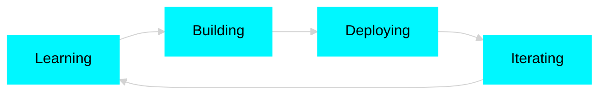

<div align="center">

# 『 MD. EMON MIAH 』


</div>

```ascii
╔═══════════════════════════════════════════════════════════════╗
║  ⚡ MERN Stack Developer | Code Craftsman | Problem Solver   ║
╚═══════════════════════════════════════════════════════════════╝
```

<div align="center">

[](https://git.io/typing-svg)

</div>

---

## 🌊 **ABOUT ME**

```typescript
const emon = {
    location: "Dhaka, Bangladesh 🇧🇩",
    current_focus: ["Advanced React Patterns", "System Design", "Cloud Architecture"],
    coding_philosophy: "Write code that tells a story, not a mystery",
    ask_me_about: ["MERN Stack", "Web Performance", "UI/UX", "RESTful APIs"],
    fun_fact: "I debug with console.log() and I'm not ashamed 😎"
};
```

<div align="center">

### 💬 **GET IN TOUCH**

[](mailto:emon747415@gmail.com)
[](https://linkedin.com/in/maremon7415)
[](https://emondev.netlify.app/)

</div>

---

## 🛠️ **ARSENAL**

<div align="center">

### Frontend Mastery


### Backend Power


### Tools & Workflow


</div>

---

## 🚀 **FEATURED PROJECTS**

<table align="center">
<tr>
<td width="50%" valign="top">

### 💬 Chit-Chat (Chatify)
**Real-Time Communication Platform**

- ⚡ Built with React, Tailwind CSS & Socket.io
- 🔐 Secure authentication system
- 💨 Lightning-fast message delivery
- 🎨 Clean, intuitive interface

🔗 **[Live Demo](https://chitchat-1h8wz.sevalla.app/)** | **[Code](https://github.com/maremon7415)**

</td>
<td width="50%" valign="top">

### 🛍️ E-Commerce Platform
**Full-Stack MERN Application**

- 🛒 Complete shopping cart functionality
- 👤 JWT authentication & authorization
- 📊 Admin dashboard for management
- 💳 Secure payment integration

🔗 **[Frontend](https://myshop-frontend-puce.vercel.app)** | **[Admin](https://myshop-admin-taupe.vercel.app/)**

</td>
</tr>
<tr>
<td width="50%" valign="top">

### 💼 Portfolio Website
**Modern Developer Showcase**

- ✨ GSAP animations & smooth scrolling
- 📧 EmailJS contact integration
- 📱 Fully responsive design
- 🎯 Performance optimized

🔗 **[View Live](https://emondev.netlify.app/)** | **[Repository](https://github.com/maremon7415/Portfolio)**

</td>
<td width="50%" valign="top">

### 🔮 More Coming Soon...
**Always Building, Always Learning**

Currently working on:
- 🤖 AI-powered tools
- 📱 Mobile-first applications
- ☁️ Cloud-native solutions

🔗 **[Explore More](https://github.com/maremon7415?tab=repositories)**

</td>
</tr>
</table>

---

## 📊 **GITHUB ANALYTICS**

<div align="center">


</div>

---

## 🎯 **CURRENT MISSION**

<div align="center">



</div>

- 🔥 Mastering **Advanced React Patterns** (Context, Hooks, Performance)
- ☁️ Exploring **AWS & Cloud Deployment** strategies
- 🏗️ Building **production-ready MERN applications**
- 📚 Deep diving into **System Design** & **Architecture**
- 🤝 Seeking **internship opportunities** to grow professionally

---

## 🌐 **CONNECT WITH ME**

<div align="center">

[](https://linkedin.com/in/maremon7415)
[](https://github.com/maremon7415)
[](https://facebook.com/maremon7415)
[](https://emondev.netlify.app/)

</div>

---

<div align="center">

### 💭 **PHILOSOPHY**

```
┌─────────────────────────────────────────────────────────────┐
│                                                             │
│  "Any fool can write code that a computer can understand.  │
│   Good programmers write code that humans can understand." │
│                                                             │
│                           — Martin Fowler                   │
│                                                             │
└─────────────────────────────────────────────────────────────┘
```

### ⭐ **Thanks for stopping by — Let's build something amazing together!** ⭐


</div>
